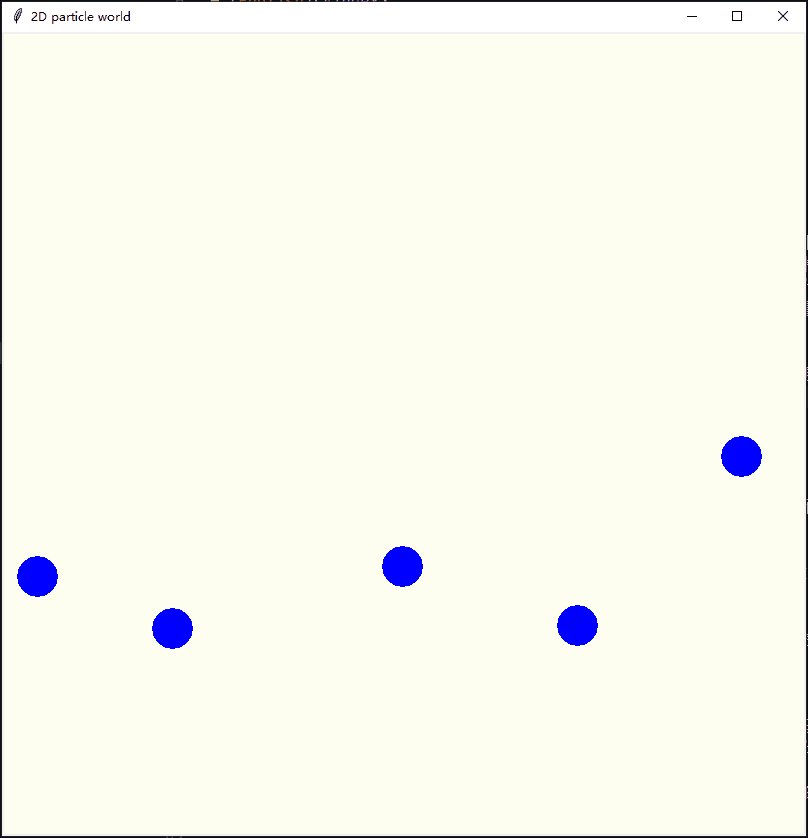

# 二维粒子世界（2D Particle World）

## 语言（language）

- [中文](#目录)
- [English](#index)

## 目录

- [概述](#概述)
- [示例程序](#示例程序)
- [模块说明](#模块说明)
- [工作计划](#工作计划)

## 概述

“二维粒子世界”是我个人为了学习几何知识、物理模拟和图形渲染而创建的一个小项目。
最终的目标是能够在二维世界中完全模拟三维世界中各种粒子的物理属性，以及这些粒子构成的宏观物质的运动和变化规律。
当然，现在本项目还处在只能模拟真空中的完美均质无自旋的圆在平行向下的重力的作用下互相碰撞的阶段。
就算如此，这些粒子（圆）的运动仍然不够物理：在模拟过程中，穿模偶有发生，能量持续不守恒。
这些问题将来都会一步一步进行解决。

本项目使用 Python 作为编写语言，目的在于方便更多的人学习和使用，同时也方便我快速进行实现。
实现“二维粒子世界”主要需要考虑两方面的工作：

1. 使用几何知识对粒子的物理模拟进行解算，即项目的物理后端；
1. 使用图形编程对粒子的具体表现进行渲染，即项目的渲染前端；

当前渲染前端使用的图形库是 `Tkinter`，这个库简单且易于使用，但因为其本身不是为快速渲染设计的，所以绘制效率较低，且无法使用 GPU 加速。
示例程序中，我仅仅渲染了五个粒子，程序运行起来就已经十分吃力了。
如果没有使用较为先进的 CPU，在运行示例程序时，会发现渲染画面的卡顿十分严重。
所以后面我准备将 `Tkinter` 图形库换成 `PyOpenGL`。

目前项目暂由我个人推动，欢迎感兴趣的同学了解我的项目，提出宝贵的意见或是直接贡献你的代码。

## 示例程序

在项目的根目录中，我提供了一份简单的示例程序 `example.py`，参照里面的代码，可以很容易的写出自己的示例程序。
不过为了想法的快速实现，目前项目中的一些地方使用了简单粗暴的实现方式，所以你自己编写的示例程序，可能无法按照你想象的样子运行。
但是 `example.py` 的运行结果应该是正常的，别忘了检查你是否已经安装了最新的 `Tkinter` 图形库。
示例程序运行的样子应当如下所示：



## 模块说明

为了简洁明确，便于理解，我使用文件组织的方式来说明各模块及其包含的各个文件的作用：

```xml
.
├── resource            # 物理资源模块
│   ├── constants.py        # 模块常量
│   ├── particles.py        # 粒子类
│   ├── theorems.py         # 物理定律函数
│   └── world.py            # 二维粒子世界类：控制世界中的粒子之间及粒子和其他物理实体的交互
├── scene               # 场景渲染模块
│   ├── constants.py        # 模块常量
│   ├── draw_command.py     # 绘制命令类：将物理实体转变为图形实体
│   ├── ipass.py            # 渲染过程类：更新和绘制图形实体
│   └── iscene.py           # 场景管理类：将二维粒子世界装配为渲染场景，并控制渲染过程
└── util                # 工具模块
    ├── constants.py        # 模块常量
    ├── ops.py              # 数学函数
    └── shapes.py           # 图形类：包括点、向量、圆、矩形等图形类
```

## 工作计划

由于本项目还处于非常早期的阶段，所以未来还有许多工作需要完成。
我把我暂时能想到的工作按顺序列在下面，将来进行实现时，也会大致按照这样的先后顺序来进行这些工作：

- 方向板
  - 单向板：粒子只能单向通过
  - 零向板：粒子无法通过
- 场
  - 重力场
    - 平行重力场
    - 中心重力场
  - 电磁场
- 能量守恒
- 速度限制：二维粒子世界的光速
- 易于理解的注释
- 按键映射支持
- 提供更多主题的示例程序：
  - 粒子捕捉器
  - 太阳系
  - 三星系统
  - 最速下降轨道
- 宏观物体
  - 气体
  - 液体
- 粒子自旋
- 图形用户界面

## Index

- [Introduction](#introduction)
- [Example](#example)
- [Modules](#modules)
- [Plan](#plan)

## Introduction

"2D Particle World" is an experimental project which aims at helping me to acquire knowledges about geometry, physical simulation and graphics rendering.
The ultimate goal of this project is to totally simulate the physical attributes of 3D particles in 2D world.
Also the simulation of macro substances consisted of 2D particles is included.
Currently, the structure of this project can only support the collision simulation of perfect homogeneous non-spin circles in the environment which has parallelled down-side gravity.
Though it is very primitive, particle clipping still may happen, and energy conservation is always broken.
I will try to fix these bugs in the future to make the 2D particle world more physical.

This project is coded purely with `Python` programming language.
I hope this can help as many as possible peoples to learn or use my repository.
Also I can benefit from this in quickly implementation of my ideas.
Before I talk more about this project, I want to summarize the structure of this project into two parts:

1. physical back-end: serve for resolving the simulation of particles based on geometry theories.
2. rendering front-end: serve for drawing and rendering the particle simulation results with graphic programming.

Presently, I use `Tkinter` graphic library as my rendering front-end.
This library is very easy to learn and use, but it is not designed for fast graphic rendering and can not take advantage of GPU acceleration.
Thus it's inefficiency on drawing and rendering is too apparent to be ignored.
In our example, we only rendering `5` particles in the meanwhile, but it seems that rendering system is already overloaded.
Even running on a not-so-bad CPU, the frame rate of simulation is low enough to make the world seems like the time elapsing is slowed down.
To solve this problem, we decided to replace `Tkinter` graphic library with `PyOpenGL`.

Now, this project is push forward by myself.
I'm very glad to see that anyone who interests in my project is willing to know more about my project, comment on it or contribute codes to my project directly.

## Example

I provide a simple example in the root directory of this project, which name should be `example.py`.
Take the example as reference, you are able to write your own example within a minite.
But it's a pity that your example process may not perform the simulation correctly as your wish.
Because, for the purpose of quick implementation, I just hack in the implementation of some functions.
At least, I ensure that the example provided by this project is always right.
Before you try it, do not forget to check whether you have installed `Tkinter` graphic library.
The simulation of example should looks like this:


## Modules

To be concise, I list the modules and the files in these modules without breaking their original organization.
The illustration about the modules and files are followed each item:

```xml
.
├── resource            # Physical Resource Module
│   ├── constants.py        # module constants
│   ├── particles.py        # particle classes
│   ├── theorems.py         # physical therorems
│   └── world.py            # 2d particle world class: control the interaction between particles
│                             and between particle and other physical entities
├── scene               # Scene Rendering Module
│   ├── constants.py        # module constants
│   ├── draw_command.py     # draw command class: create graphic entity based on physical entity
│   ├── ipass.py            # pass class: update and render graphic entities in the pass
│   └── iscene.py           # scene manager class: pack the 2D particle world and control the
│                             scene rendering
└── util                # Utility Module
    ├── constants.py        # module constants
    ├── ops.py              # math functions
    └── shapes.py           # shape classes: include point, vector, circle, rectangle classes
```

## Plan

Since this project is in the very beginning stage, there are many works need to be done in the future.
I list some of those in the following, I will implement those works in the order of them listed:

- direction slab
  - one way slab: only allow particles pass from its oneside to another side
  - zero way slab: do not allow particles pass through it
- field
  - gravity field
    - force direction parallelled gravity field
    - force direction converged gravity field
  - electromagnetic field
- energy conservation
- speed limitation: the light speed of 2D particle world
- code annotations
- key mapping
- more examples
  - particle trapper
  - solar system
  - three-star system
  - steepest descent trail
- macro substances
  - gas
  - liquid
- particle spin
- graphic user interface

